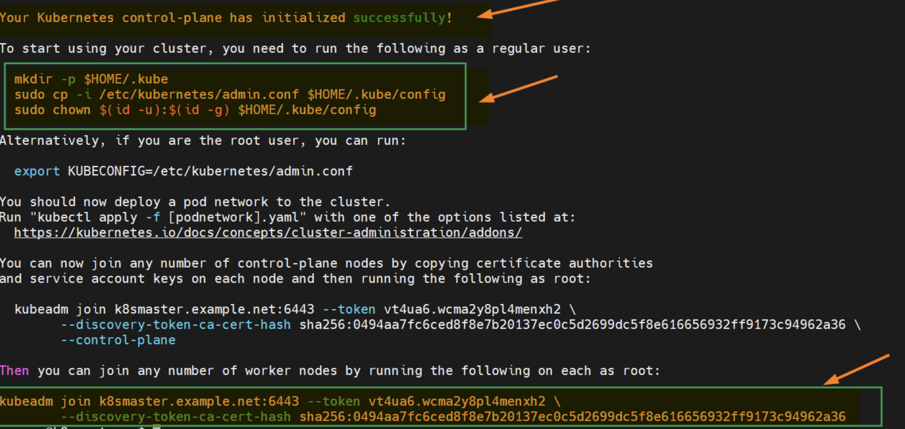
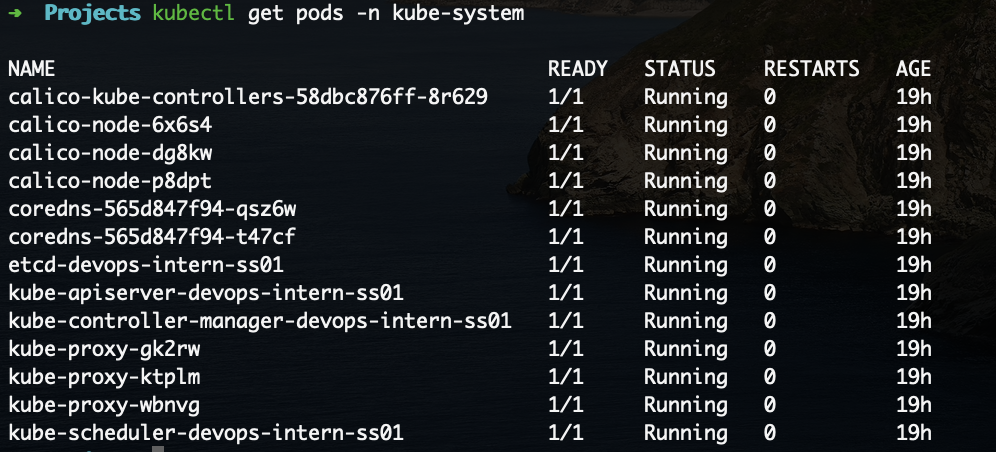
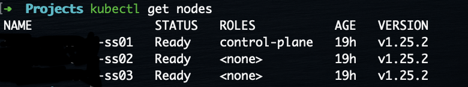

# K8S Single cluster with two worker nodes setup using Calico Network Addon

This is a simple example of a single master cluster with two worker nodes setup using Calico Network Addon.

## Prerequisites

- 3 VMs running Ubuntu 22.04 LTS with minimum requirements:
  - 2 CPUs / 2 vCPUs.
  - 2GB RAM.
  - 20GB Disk Space.
  - Internet connectivity on each node.
  - Sudo access on each node.

## Setup

### 1. Disable Swap and add kernel settings

```bash
sudo swapoff -a
sudo sed -i '/ swap / s/^\(.*\)$/#\1/g' /etc/fstab
```

Load the following kernel modules on **every single node**:

```bash
sudo tee /etc/modules-load.d/containerd.conf <<EOF
overlay
br_netfilter
EOF

sudo modprobe overlay
sudo modprobe br_netfilter
```

Set the following Kernel parameters for Kubernetes:

```bash
sudo tee /etc/sysctl.d/kubernetes.conf <<EOF
net.bridge.bridge-nf-call-iptables = 1
net.ipv4.ip_forward = 1
EOF 
```

Reload changes:

```bash
sudo sysctl --system
```

### 2. Install Docker and Containerd

Update the apt package index and install packages to allow apt to use a repository over HTTPS:

```bash
sudo apt-get update

sudo apt-get install \
    ca-certificates \
    curl \
    gnupg \
    lsb-release
```

Add Docker GPG key:

```bash
sudo mkdir -p /etc/apt/keyrings

curl -fsSL https://download.docker.com/linux/ubuntu/gpg | sudo gpg --dearmor -o /etc/apt/keyrings/docker.gpg
```

Use the following command to set up the repository:

```bash
echo \
  "deb [arch=$(dpkg --print-architecture) signed-by=/etc/apt/keyrings/docker.gpg] https://download.docker.com/linux/ubuntu \
  $(lsb_release -cs) stable" | sudo tee /etc/apt/sources.list.d/docker.list > /dev/null
```

Install Docker Engine:

```bash
sudo apt-get update

sudo apt-get install -y docker-ce docker-ce-cli containerd.io docker-compose-plugin
```

**Optional** - Verify that Docker Engine is installed correctly by running the hello-world image.

```bash
sudo service docker start
sudo docker run hello-world
```

### 3. Configure Containerd

Configure containerd so that it starts using systemd as cgroup.

```bash
containerd config default | sudo tee /etc/containerd/config.toml >/dev/null 2>&1

sudo sed -i 's/SystemdCgroup \= false/SystemdCgroup \= true/g' /etc/containerd/config.toml
```

Restart and enable containerd service

```bash
sudo systemctl restart containerd
sudo systemctl enable containerd
```

### 4. Install Kubernetes

Execute following commands to add apt repository for Kubernetes

```bash
curl -s https://packages.cloud.google.com/apt/doc/apt-key.gpg | sudo apt-key add -

sudo apt-add-repository "deb http://apt.kubernetes.io/ kubernetes-jammy main"
```

**Quick note: At the time of writing this guide, Xenial is the latest Kubernetes repository but when repository gets available for Ubuntu 22.04 (Jammy Jellyfish) you will have to replace *xenial* with *jammy* in ‘apt-add-repository’ command.**

Install Kubernetes components like kubectl, kubelet and Kubeadm utility on **all the nodes**. Run following set of commands:

```bash
sudo apt update
sudo apt install -y kubelet kubeadm kubectl
sudo apt-mark hold kubelet kubeadm kubectl
```

**apt-mark hold** command doesn't let the apps to update on their own

**Now, we are all set to initialize Kubernetes cluster. Run the following Kubeadm command from the MASTER NODE only.**

```bash
kubeadm init --pod-network-cidr=<DESIRED_INTERNAL_IP_RANGE> --apiserver-advertise-address=<INTERNAL_IP_ADDRESS_OF_YOUR_SERVER>
```

Quick explanation:

- --pod-network-cidr=10.244.0.0/16 <----- This will set up an intenral IP network with provided settings
- --apiserver-advertise-address=172.25.36.81 <----- Advertises master server's address for the nodes to join the cluster.

You will have to wait for a few minutes after executing the command above. Output should show something like this:



As the output above confirms that control-plane has been initialize successfully. In output also we are getting set of commands for interacting the cluster and also the command for worker node to join the cluster.

So, to start interacting with cluster, run following commands from the **master node**:

```bash
mkdir -p $HOME/.kube
sudo cp -i /etc/kubernetes/admin.conf $HOME/.kube/config
sudo chown $(id -u):$(id -g) $HOME/.kube/config
```

Now, try to run following kubectl commands to view cluster and node status:

```bash
kubectl cluster-info
kubectl get nodes
```

Join both the worker nodes to the cluster, Just copy and paste the command to the worker nodes.

```bash
sudo kubeadm join k8smaster.example.net:6443 --token <TOKEN> \
   --discovery-token-ca-cert-hash <discovery-token-ca-cert-hash >
```

You can also create a new token using the command below:

```bash
kubeadm token create --print-join-command
```

- **Token** will be provided in the output of the kubeadm init command just like **discovery-token-ca-cert-hash**

Check the nodes status from master node using kubectl command

```bash
kubectl get nodes
```

As you can see nodes status is **NotReady**. In order to change status to active We must install CNI (Container Network Interface) or network add-on plugins like Calico, Flannel and Weave-net.

### 5. Set up Calico Pod Network Addon

Run following curl and kubectl command to install Calico network plugin from the **master node**

```bash
curl https://projectcalico.docs.tigera.io/manifests/calico.yaml -O
kubectl apply -f calico.yaml
```

Verify the status of pods in kube-system namespace

```bash
kubectl get pods -n kube-system
```

Output should look like this:



Now test the nodes:

```bash
kubectl get nodes
```

Output should look like this:



All set! You have successfully set up Kubernetes cluster on Ubuntu 22.04 using Calico Network Addon.

#### Reference

- [Docker Docs](https://docs.docker.com/engine/install/ubuntu/#:~:text=from%20the%20repository.-,Set%20up%20the%20repository,-Update%20the%20apt)
- [K8S Docs](https://kubernetes.io/docs/setup/production-environment/tools/kubeadm/install-kubeadm/#installing-runtime)
- [Calico Docs](https://projectcalico.docs.tigera.io/getting-started/kubernetes/quickstart)
